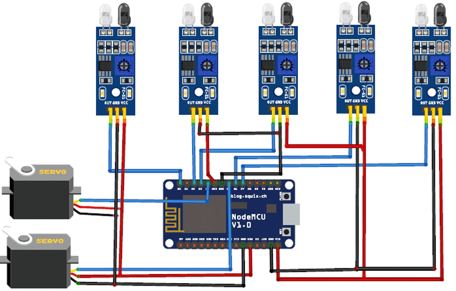

# IoT-Smart-Parking-System
## IoT based smart parking system built using NodeMCU ESP8266
With ever growing rate of cars on the roads of all cities the problem of spaces for parking is also growing rapidly. It becomes quite irritating if you do not find a parking spot and have to roam around for some available parking. Now imagine if all the parking spots were internally connected to a network and you could get real time availability information right on your mobile phone. This could probably be the end of the ‘Parking Spot Problem’. 
 
IoT (Internet of Things) aims at building networks among things (or individual sensors) that communicate with each other to provide solutions to daily life problems and make things easier. In our IoT Based Smart Parking System, we will use NodeMCU, a low-cost open source firmware developed for the Wi-Fi-enabled ESP8266 chip that will help us to send the real time data to our mobile device. The concept of car parking is very basic; we will require IR sensors at the entry and the exit point of the parking lot and some more IR sensors at the parking space. These sensors will detect the arrival and exit of cars at the parking lot and send the data to the mobile servers to keep track about the available slots in the parking lot. Further there will be IR sensors at individual parking space to keep track of where a car is parked. All the information will be sent via ESP8266 using some open source API based IoT client server. When the available slots are full, it will give a notification on the mobile phone. This is how we will build our Smart Parking Lot.
 
Equipments Required:
1.	Servo Motors (2nos. to control entry and exit)
2.	IR Sensors (5 nos.)
3.	Breadboard
4.	NodeMCU- ESP8266 Development Board
5.	Jumper Wires

Format: 
